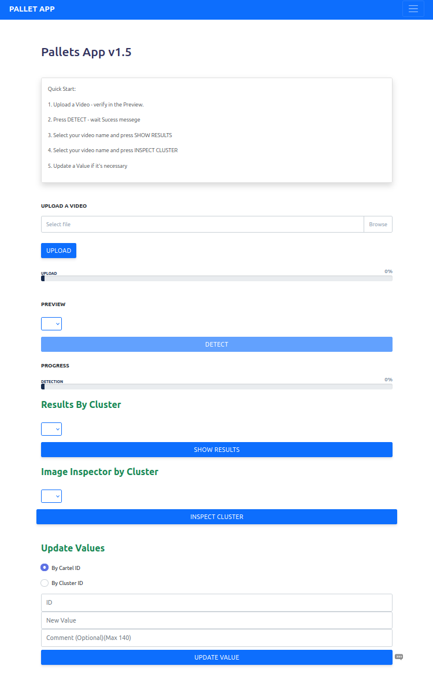
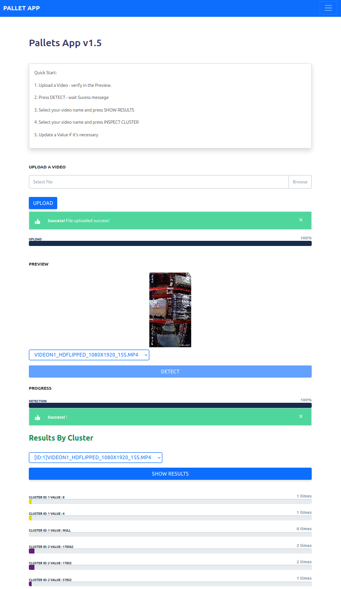
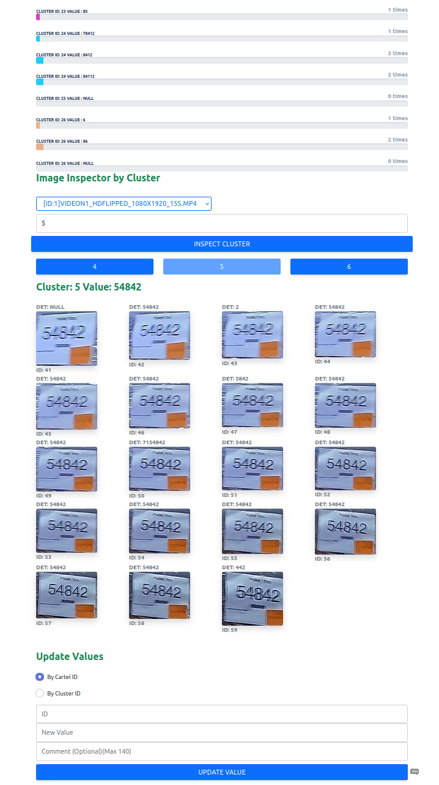
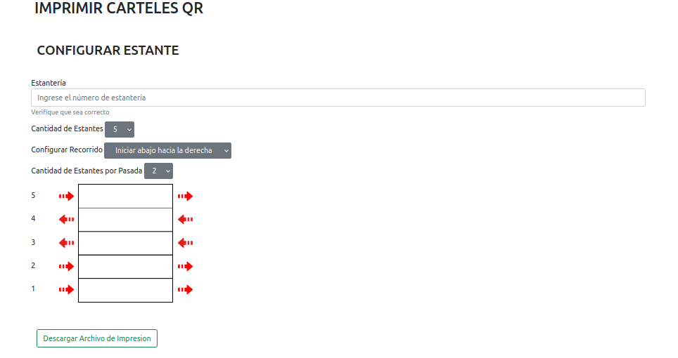
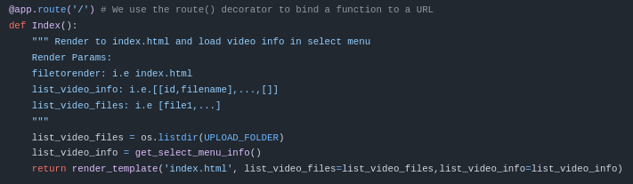
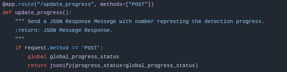
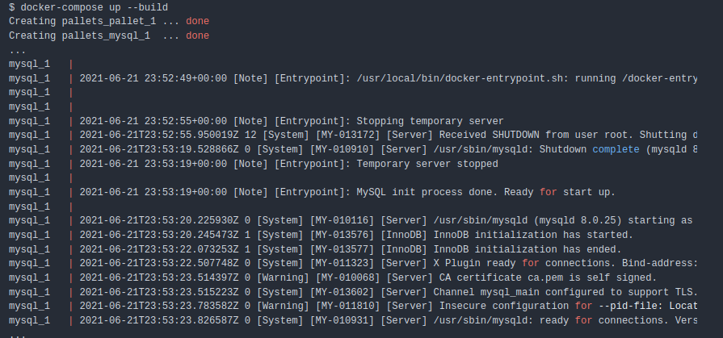
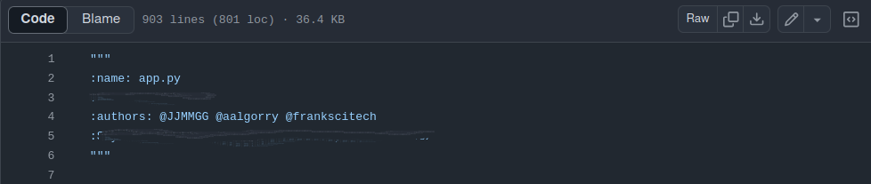

# Resumen del Proyecto Detección de Pallets
Es un proyecto de **computer vision** que consistía en realizar una aplicación web destinada a una empresa de logística. Esta aplicación debía administrar el stock y determinar la ubicación de los pallets en el lugar de almacenamiento de manera automática.

## Lenguajes, Frameworks y Software Utilizados

* MySQL.
* Python.
* Flask.
* Bootstrap.
* Docker.

## Cómo Funciona?
El usuario debe subir un video a la aplicación, este video era grabado recorriendo los estantes enfocando las etiquetas de cada pallet en el sitio de almacenamiento. La aplicación analiza las etiquetas y devuelve los valores de dichas etiquetas.

*Vista Principal*

Una vez subido el video se procedía a realizar la detección de etiquetas las cuales era agrupadas en grupos(clusters) por valores los cuales se pueden verificar manualmente.

*Luego de ejecutar la detección*

Al ser verificados manualmente podemos ver si realmente los valores estimados coinciden con los del video. En la siguiente imagen vemos que el valor es el correcto ya que la estimación 54842 al igual que cuadros agrupados. En caso de no ser correcto, lo cual en base a las pruebas realizadas era poco probable, se contaba con una opción para corregir dicho valor y dejar un comentario.

*Inspección de clusters*

Para la ubicación de los pallets se utilizaban códigos QR los cuales eran generados en la misma aplicación y también eran detectados en el video.

*Generación de QR*

## Capturas del código
Algunas capturas del código, parte que se encarga de responder al consultar la ruta raíz ('/')  y devolver la plantilla index.

*Página de inicio*

Parte que se encarga de actualizar la barra de progreso del proceso de detección.

*Actualización barra de progreso*

Salida en consola al correr el proyecto.

Creditos en el código

